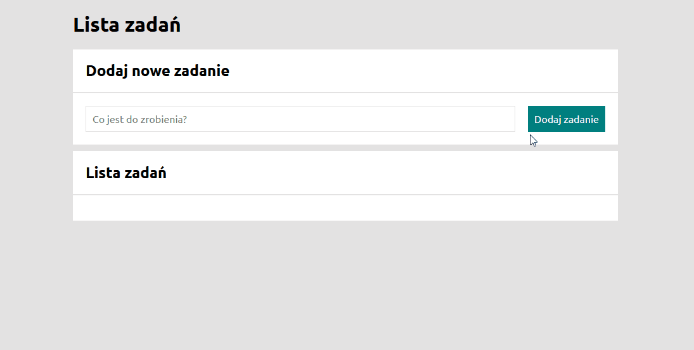

# Simple TO-DO List

## Hello!
This is a first version of Simple TO-DO List. 
Project made for YouCode academy.

[DEMO](https://k1s1el.github.io/TO-DO-List/)

## Technologies used

1. HTML.
2. CSS according to BEM convention.
3. JavaScript.

## Functionality

In this project you can create a simple to-do list. You can add a new task, toggle it done or remove.
Project is splitted into 2 sections. First one is a form field with button which adds new task.

The second one is a list where the html code is injected trough JS.

Pls see below short gif.

Best Regards,
MK
